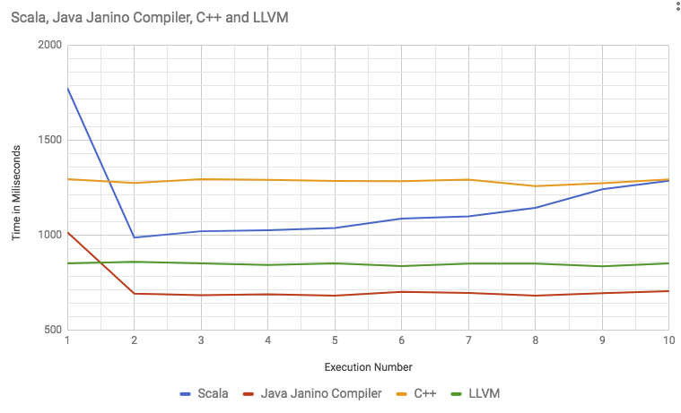

# SimpleDB - A Proof of concept

These are the test runs against each implementation of the "database".

Each implementation has the following properties
- Read file using MMap.
- Implementation of a SUM aggregation over ~1B of rows written in pure language's code.
- Code Generated implementation of a SUM aggregation over ~1B of rows.

#### __Note__: these tests were run in a Mac Book Pro with a 2.7 GHz Intel Core i5 and 16GB of memory at 1867MHz DDR3.

### CPP Implementation

Code generation through LLVM.

Execution log for 1 billion rows:

```
[0] Rows(1074322440) Bytes(268580610) :: Import Duration: 89.674ms :: Native[98046182862] Duration: 1294.31ms :: Codegen[98046182862] Duration: 851.655ms :: Diff: 442.650ms - 41.2543%
[1] Rows(1074322440) Bytes(268580610) :: Import Duration: 82.583ms :: Native[98046182862] Duration: 1274.95ms :: Codegen[98046182862] Duration: 859.895ms :: Diff: 415.055ms - 38.8839%
[2] Rows(1074322440) Bytes(268580610) :: Import Duration: 82.516ms :: Native[98046182862] Duration: 1294.37ms :: Codegen[98046182862] Duration: 851.496ms :: Diff: 442.878ms - 41.2772%
[3] Rows(1074322440) Bytes(268580610) :: Import Duration: 84.369ms :: Native[98046182862] Duration: 1291.12ms :: Codegen[98046182862] Duration: 843.344ms :: Diff: 447.775ms - 41.9567%
[4] Rows(1074322440) Bytes(268580610) :: Import Duration: 81.365ms :: Native[98046182862] Duration: 1284.77ms :: Codegen[98046182862] Duration: 851.754ms :: Diff: 433.015ms - 40.5346%
[5] Rows(1074322440) Bytes(268580610) :: Import Duration: 81.586ms :: Native[98046182862] Duration: 1283.66ms :: Codegen[98046182862] Duration: 837.865ms :: Diff: 445.798ms - 42.0261%
[6] Rows(1074322440) Bytes(268580610) :: Import Duration: 84.106ms :: Native[98046182862] Duration: 1292.51ms :: Codegen[98046182862] Duration: 850.399ms :: Diff: 442.111ms - 41.2627%
[7] Rows(1074322440) Bytes(268580610) :: Import Duration: 81.795ms :: Native[98046182862] Duration: 1258.03ms :: Codegen[98046182862] Duration: 850.712ms :: Diff: 407.321ms - 38.6316%
[8] Rows(1074322440) Bytes(268580610) :: Import Duration: 84.782ms :: Native[98046182862] Duration: 1273.76ms :: Codegen[98046182862] Duration: 836.258ms :: Diff: 437.500ms - 41.4689%
[9] Rows(1074322440) Bytes(268580610) :: Import Duration: 80.538ms :: Native[98046182862] Duration: 1293.76ms :: Codegen[98046182862] Duration: 852.288ms :: Diff: 441.470ms - 41.1426%
```

### Scala Implementation (JVM)

Code generation through Java JIT compilation using the Janino compiler.

Execution log for 1 billion rows:

```
[0] Rows(1074322440) Bytes(268580610) :: Import Duration: 24.0ms :: Native[98046182862] Duration: 1774.0ms :: Codegen[98046182862] Duration: 1016.0ms :: Diff 758.0ms 54.336918%
[1] Rows(1074322440) Bytes(268580610) :: Import Duration:  0.0ms :: Native[98046182862] Duration:  988.0ms :: Codegen[98046182862] Duration:  693.0ms :: Diff 295.0ms 35.098156%
[2] Rows(1074322440) Bytes(268580610) :: Import Duration:  0.0ms :: Native[98046182862] Duration: 1021.0ms :: Codegen[98046182862] Duration:  685.0ms :: Diff 336.0ms 39.39039%
[3] Rows(1074322440) Bytes(268580610) :: Import Duration:  0.0ms :: Native[98046182862] Duration: 1026.0ms :: Codegen[98046182862] Duration:  689.0ms :: Diff 337.0ms 39.300293%
[4] Rows(1074322440) Bytes(268580610) :: Import Duration:  0.0ms :: Native[98046182862] Duration: 1038.0ms :: Codegen[98046182862] Duration:  683.0ms :: Diff 355.0ms 41.255085%
[5] Rows(1074322440) Bytes(268580610) :: Import Duration:  0.0ms :: Native[98046182862] Duration: 1088.0ms :: Codegen[98046182862] Duration:  702.0ms :: Diff 386.0ms 43.12849%
[6] Rows(1074322440) Bytes(268580610) :: Import Duration:  0.0ms :: Native[98046182862] Duration: 1099.0ms :: Codegen[98046182862] Duration:  697.0ms :: Diff 402.0ms 44.766148%
[7] Rows(1074322440) Bytes(268580610) :: Import Duration:  0.0ms :: Native[98046182862] Duration: 1144.0ms :: Codegen[98046182862] Duration:  682.0ms :: Diff 462.0ms 50.602413%
[8] Rows(1074322440) Bytes(268580610) :: Import Duration:  0.0ms :: Native[98046182862] Duration: 1242.0ms :: Codegen[98046182862] Duration:  695.0ms :: Diff 547.0ms 56.47909%
[9] Rows(1074322440) Bytes(268580610) :: Import Duration:  0.0ms :: Native[98046182862] Duration: 1287.0ms :: Codegen[98046182862] Duration:  706.0ms :: Diff 581.0ms 58.304066%

```


## Analysis of executions

Graph of the above execution for 1 billion rows

